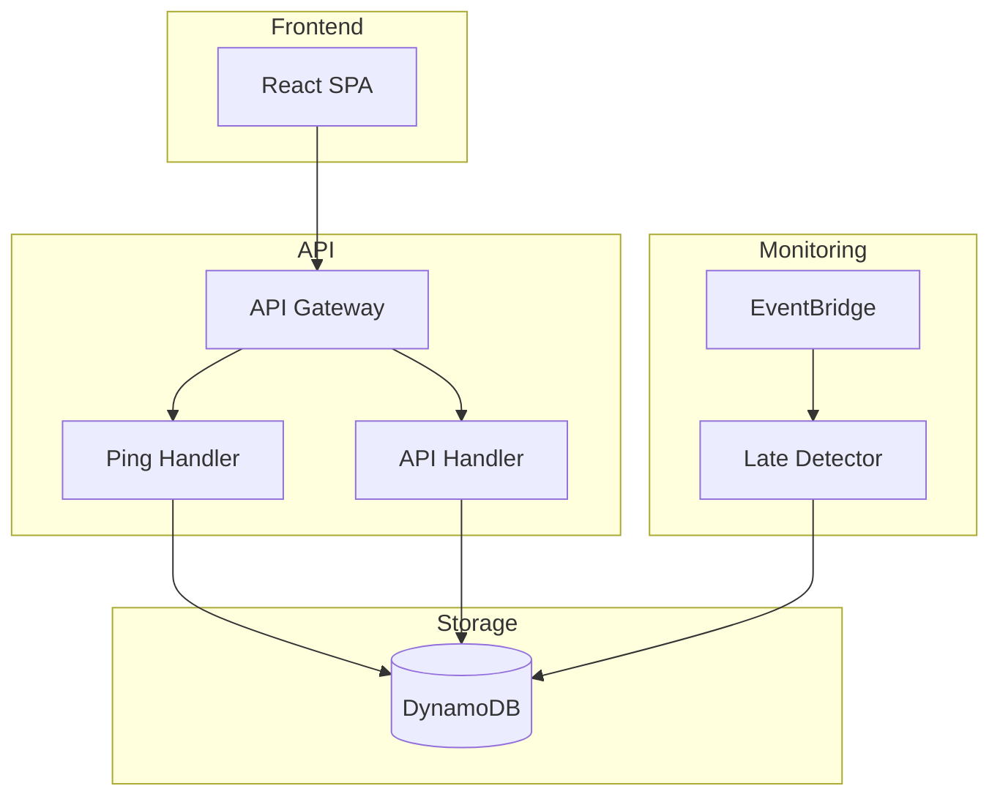

# Pulsechecks

A serverless, multi-tenant job monitoring service with multi-cloud support (AWS and GCP).

## Features

- **Multi-Cloud**: Deploy to AWS or GCP - choose your platform
- **Serverless**: No always-on compute, pay per use
- **Multi-tenant**: Team-based isolation with RBAC
- **Google Workspace Auth**: OAuth integration (Cognito or Firebase)
- **Interval Schedules**: Monitor jobs with configurable periods and grace times
- **Late Detection**: Sub-2-minute detection
- **Alerting**: Email and Mattermost webhook notifications
- **Cost-Optimized**: AWS <$10/month, GCP $0-2/month (free tier)

## Quick Start

```bash
# Clone repository
git clone https://github.com/your-username/pulsechecks.git
cd pulsechecks

# Deploy to your chosen cloud platform
./deploy.sh  # Interactive: choose AWS (1) or GCP (2)

# Or specify directly
CLOUD_PROVIDER=aws ./deploy.sh   # Deploy to AWS
CLOUD_PROVIDER=gcp ./deploy.sh   # Deploy to GCP

# Create a check and start monitoring
curl https://api.pulsechecks.example.com/ping/{your-token}
```

## CI/CD Options

Pulsechecks includes ready-to-use CI/CD pipelines for both GitHub Actions and GitLab CI:

- **GitHub Actions**: See [.github/workflows/README.md](.github/workflows/README.md)
  - `test.yml` - Automated testing on PRs
  - `aws-deploy.yml` - AWS deployment pipeline
  - `gcp-deploy.yml` - GCP deployment pipeline

- **GitLab CI**: See `.gitlab-ci.yml`
  - Tests, builds, and deployments for both clouds
  - Controlled via `DEPLOY_TARGET` variable

Both systems support:
- ✅ Automated testing with coverage
- ✅ Multi-cloud deployment
- ✅ Manual workflow triggers
- ✅ OIDC authentication (no long-lived credentials)

## Cloud Platform Comparison

| Feature        | AWS                  | GCP                       |
| -------------- | -------------------- | ------------------------- |
| **Compute**    | Lambda (3 functions) | Cloud Run (1 service)     |
| **Database**   | DynamoDB             | Firestore Native          |
| **Auth**       | Cognito              | Firebase Auth             |
| **Frontend**   | S3 + CloudFront      | Firebase Hosting          |
| **Monitoring** | CloudWatch           | Cloud Logging/Monitoring  |
| **Est. Cost**  | $10-15/month         | $0-2/month (free tier)    |

See [Multi-Cloud Architecture](docs/multi-cloud-architecture.md) for detailed comparison.

## Documentation

📖 **[Complete Documentation](docs/README.md)**

- [Getting Started](docs/getting-started.md) - Setup and deployment
- [Architecture](docs/architecture.md) - System design and components  
- [API Reference](docs/api-reference.md) - Complete API documentation
- [Alert Channels](docs/alert-channels.md) - Creating and managing notifications
- [Operations](docs/operations.md) - Monitoring and troubleshooting
- [Development](docs/development.md) - Developer guide

## Architecture Overview



## Usage Example

```bash
# Simple ping
curl https://api.pulsechecks.example.com/ping/abc123def456

# With data
curl -X POST https://api.pulsechecks.example.com/ping/abc123def456 \
  -H "Content-Type: application/json" \
  -d '{"status": "Backup completed: 1.2GB"}'
```

## Development

```bash
# Backend
cd backend
pip install -r requirements.txt
pytest tests/ -v
python -m uvicorn main:app --reload

# Frontend  
cd frontend
npm install
npm run dev
```

## License

MIT
