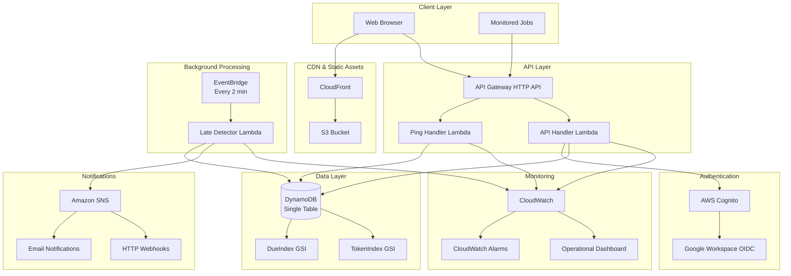
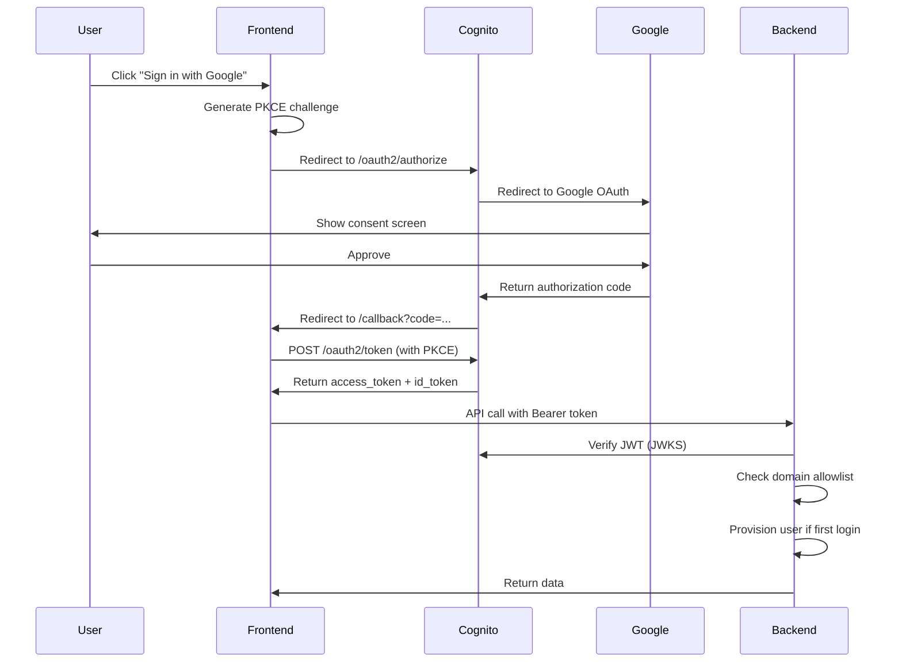
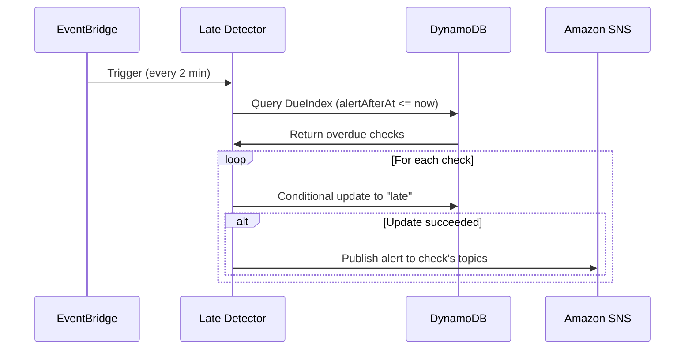
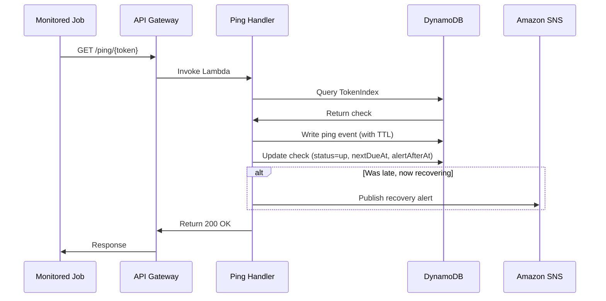

# Pulsechecks Architecture

## Overview

Pulsechecks is a serverless, multi-tenant job monitoring service built entirely on AWS managed services. The architecture prioritizes low cost, high availability, and minimal operational overhead.

## Architecture Diagram



    Browser -->|HTTPS| CF
    CF --> S3
    Browser -->|API Calls| APIGW
    Job -->|Ping| APIGW

    APIGW --> PingLambda
    APIGW --> APILambda

    APILambda --> Cognito
    Cognito --> Google

    PingLambda --> DDB
    PingLambda --> GSI2
    APILambda --> DDB

    EB -->|Trigger| LateLambda
    LateLambda --> GSI1
    LateLambda --> DDB
    LateLambda --> SQS

    SQS --> AlertLambda
    SQS -.->|Failed| DLQ

    AlertLambda --> DDB
    AlertLambda --> SES
    AlertLambda --> Webhook
```

## Components

### Frontend (React SPA)

- **Technology**: React 18, Vite, TailwindCSS
- **Hosting**: S3 + CloudFront
- **Authentication**: Cognito Hosted UI with PKCE
- **State Management**: React hooks
- **Routing**: React Router v6

**Key Features**:
- Team management with member roles
- Check creation and configuration
- Real-time status display
- Ping history viewer
- Alert topic management
- Token rotation and check deletion
- Copy-to-clipboard ping URLs

### API Gateway (HTTP API)

- **Type**: AWS API Gateway HTTP API (lower cost than REST API)
- **Authentication**: JWT validation via Cognito
- **CORS**: Configured for frontend domain
- **Rate Limiting**: 100 req/min general, 1000 req/min for pings

**Routes**:
- `/health` - Health check (no auth)
- `/ping/{token}` - Ping endpoints (no auth, token-based)
- `/me` - User profile
- `/teams/*` - Team and check management
- `/teams/{id}/alerts/*` - SNS alert management
- `/teams/{id}/members/*` - Team member management

### Lambda Functions

#### 1. Ping Handler (`pulsechecks-ping-prod`)
- **Runtime**: Python 3.13
- **Memory**: 256MB
- **Timeout**: 30s
- **Triggers**: API Gateway ping routes

**Responsibilities**:
- Validate ping tokens via DynamoDB GSI
- Record ping events with timestamps
- Update check status (up/late)
- Send recovery alerts via SNS
- Structured logging with correlation IDs

#### 2. API Handler (`pulsechecks-api-prod`)
- **Runtime**: Python 3.13
- **Memory**: 256MB  
- **Timeout**: 30s
- **Triggers**: API Gateway authenticated routes

**Responsibilities**:
- JWT validation and user management
- Team and check CRUD operations
- Member management with RBAC
- SNS topic management for alerts
- Input validation and rate limiting

#### 3. Late Detector (`pulsechecks-late-detector-prod`)
- **Runtime**: Python 3.13
- **Memory**: 512MB
- **Timeout**: 60s
- **Triggers**: EventBridge (every 2 minutes)

**Responsibilities**:
- Query DynamoDB GSI for overdue checks
- Update check status to 'late'
- Send late alerts directly via SNS
- Batch processing for efficiency

### API Gateway HTTP API

- **Type**: HTTP API (cheaper than REST API)
- **CORS**: Enabled for frontend domain
- **Routes**:
  - Public: `GET/POST /ping/{token}`
  - Authenticated: `/me`, `/teams/*`, `/teams/{id}/checks/*`

**Cost**: ~$1/million requests (first 300M requests/month)

### Lambda Functions

#### 1. Ping Handler
- **Runtime**: Python 3.13
- **Memory**: 256 MB
- **Timeout**: 30s
- **Trigger**: API Gateway (public endpoint)
- **Function**:
  - Lookup check by token (TokenIndex GSI)
  - Record ping event with TTL
  - Update check status and next due time
  - Enqueue recovery alert if recovering from late

#### 2. API Handler
- **Runtime**: Python 3.13
- **Memory**: 256 MB
- **Timeout**: 30s
- **Trigger**: API Gateway (authenticated endpoints)
- **Function**:
  - JWT validation via Cognito JWKS
  - Domain allowlist enforcement
  - RBAC permission checks
  - CRUD operations for teams and checks

#### 3. Late Detector
- **Runtime**: Python 3.13
- **Memory**: 512 MB
- **Timeout**: 60s
- **Trigger**: EventBridge (every 2 minutes)
- **Function**:
  - Query DueIndex GSI for overdue checks
  - Conditional update to "late" status
  - Send late alerts directly via SNS
  - Batch processing for efficiency

### DynamoDB Single-Table Design

**Table**: `pulsechecks-prod`

**Primary Key**:
- PK (String): Partition key
- SK (String): Sort key

**Entities**:

| Entity | PK | SK | Attributes |
|--------|----|----|------------|
| Team | `TEAM#{teamId}` | `METADATA` | name, createdAt, createdBy |
| Membership | `TEAM#{teamId}` | `MEMBER#{userId}` | role, joinedAt |
| User | `USER#{userId}` | `PROFILE` | email, name, createdAt, lastLoginAt |
| Check | `TEAM#{teamId}` | `CHECK#{checkId}` | name, periodSeconds, graceSeconds, status, lastPingAt, nextDueAt, alertAfterAt, token, alertTopics |
| Ping | `CHECK#{checkId}` | `PING#{epochMillis}` | receivedAt, data, TTL |
| Invitation | `TEAM#{teamId}` | `INVITATION#{email}` | email, role, invitedAt, invitedBy |

**Global Secondary Indexes**:

1. **DueIndex** (for late detection)
   - GSI1PK: `DUE` (constant)
   - GSI1SK: `alertAfterAt` (epoch seconds)
   - Projection: ALL
   - Query pattern: Find all checks where `alertAfterAt <= now`

2. **TokenIndex** (for ping lookup)
   - GSI2PK: `TOKEN#{token}`
   - GSI2SK: `CHECK` (constant)
   - Projection: ALL
   - Query pattern: Find check by ping token

**TTL**: Enabled on `TTL` attribute (30 days for ping events)

**Billing**: On-demand (pay per request)

### Amazon SNS Integration

**Alert Topics**: Team-managed SNS topics for notifications
**Subscriptions**: Email, SMS, and HTTP webhook endpoints
**Delivery**: Direct from Late Detector Lambda (no SQS queue)
**Retry**: Built-in SNS retry with exponential backoff

### Authentication Flow



### Late Detection Flow



### Ping Flow



## Data Flow

### Check Lifecycle

1. **Creation**
   - User creates check via UI
   - API generates unique `checkId` and secret `token`
   - Initial state: `status=up`, `nextDueAt=now+period`, `alertAfterAt=nextDueAt+grace`
   - Check added to DueIndex GSI

2. **Normal Operation**
   - Job pings endpoint before `nextDueAt`
   - Status remains `up`
   - `nextDueAt` and `alertAfterAt` recalculated from ping time

3. **Going Late**
   - No ping received by `alertAfterAt`
   - Late detector queries DueIndex
   - Conditional update: `status=late`
   - Alert enqueued to SQS

4. **Recovery**
   - Ping received while `status=late`
   - Status updated to `up`
   - Recovery alert enqueued

5. **Pause/Resume**
   - User pauses check
   - Status set to `paused`
   - Removed from DueIndex (GSI1PK set to "PAUSED")
   - No late detection while paused

## Scaling Characteristics

### Horizontal Scaling
- **Lambda**: Automatic, up to account concurrency limit (1000 default)
- **DynamoDB**: On-demand scaling, no capacity planning needed
- **API Gateway**: Automatic, 10,000 RPS default limit
- **SQS**: Unlimited throughput

### Vertical Scaling
- Lambda memory can be increased (256 MB → 512 MB → 1024 MB)
- DynamoDB can switch to provisioned capacity for predictable workloads

### Bottlenecks
1. **Late Detector**: Processes 100 checks per invocation
   - Solution: Increase batch size or run more frequently
2. **SES**: 14 emails/second in sandbox, 50/second in production
   - Solution: Request limit increase
3. **DynamoDB GSI**: Query limit 1 MB per request
   - Solution: Pagination for large result sets

## Cost Analysis

### Monthly Cost Estimate (100 checks, mixed intervals)

| Service | Usage | Cost |
|---------|-------|------|
| DynamoDB | ~500K reads, 100K writes | $1.50 |
| Lambda | ~50K invocations, 1 GB-sec | $0.50 |
| API Gateway | ~50K requests | $0.05 |
| EventBridge | ~21,600 invocations | $0.02 |
| SNS | ~1K messages | $0.01 |
| CloudFront | ~1 GB transfer | $0.10 |
| S3 | ~1 GB storage | $0.02 |
| **Total** | | **~$2.21/month** |

### Cost at Scale (1000 checks)

| Service | Usage | Cost |
|---------|-------|------|
| DynamoDB | ~5M reads, 1M writes | $15.00 |
| Lambda | ~500K invocations, 10 GB-sec | $5.00 |
| API Gateway | ~500K requests | $0.50 |
| EventBridge | ~21,600 invocations | $0.02 |
| SNS | ~10K messages | $0.05 |
| CloudFront | ~10 GB transfer | $1.00 |
| S3 | ~1 GB storage | $0.02 |
| **Total** | | **~$21.68/month** |

## Security

### Authentication & Authorization
- JWT validation via Cognito JWKS
- Domain allowlist enforcement
- RBAC at team level (admin/editor/viewer)
- PKCE for OAuth flow

### Data Protection
- All data encrypted at rest (DynamoDB, S3)
- All data encrypted in transit (TLS 1.2+)
- Secrets in SSM Parameter Store / Secrets Manager
- No hardcoded credentials

### Network Security
- API Gateway with CORS restrictions
- CloudFront with HTTPS only
- S3 bucket not publicly accessible
- Lambda in VPC not required (uses AWS PrivateLink)

### Least Privilege
- Lambda execution role with minimal permissions
- API Gateway resource policies
- S3 bucket policies for CloudFront OAC only

## Monitoring & Observability

### CloudWatch Logs
- All Lambda functions log to CloudWatch
- API Gateway access logs
- Retention: 7 days (configurable)

### CloudWatch Metrics
- Lambda invocations, errors, duration
- DynamoDB consumed capacity, throttles
- API Gateway request count, latency, errors
- SQS queue depth, message age

### Alarms (Recommended)
- Lambda error rate > 5%
- DynamoDB throttled requests > 0
- SQS DLQ message count > 0
- API Gateway 5xx errors > 10/min

### Tracing
- X-Ray can be enabled on Lambda functions
- Trace entire request flow from API Gateway → Lambda → DynamoDB

## Disaster Recovery

### Backup
- DynamoDB Point-in-Time Recovery enabled
- S3 versioning can be enabled
- Terraform state in S3 with versioning

### Recovery Time Objective (RTO)
- Infrastructure: ~10 minutes (Terraform apply)
- Data: ~5 minutes (DynamoDB restore)
- Total: ~15 minutes

### Recovery Point Objective (RPO)
- DynamoDB: 5 minutes (PITR granularity)
- Ping events: 30 days (TTL)

## Limitations & Trade-offs

### MVP Limitations
1. **Interval-based only**: No cron expressions
2. **Single region**: No multi-region deployment
3. **Email + webhook only**: No Slack/PagerDuty native integration
4. **30-day ping history**: Older pings automatically deleted
5. **No check dependencies**: Can't chain checks

### Design Trade-offs
1. **Single-table design**: Complex queries but lower cost
2. **On-demand DynamoDB**: Higher per-request cost but no capacity planning
3. **2-minute detection**: Balance between cost and responsiveness
4. **In-memory tokens**: Better security but requires re-login after refresh
5. **No WebSockets**: Polling for updates, simpler architecture

## Future Enhancements

### Phase 2
- Cron schedule support
- Slack/PagerDuty integrations
- Check groups and dependencies
- Custom alert templates
- Webhook retry logic
- API rate limiting

### Phase 3
- Multi-region deployment
- Check history analytics
- Uptime percentage tracking
- Status page generation
- Mobile app
- Terraform module for easy deployment

## Comparison to Alternatives

### vs. healthchecks.io
- ✅ Lower cost at scale
- ✅ No server management
- ✅ Integrated with AWS ecosystem
- ❌ No cron support (yet)
- ❌ Less mature feature set

### vs. Cronitor
- ✅ Much lower cost
- ✅ Open source
- ✅ Self-hosted
- ❌ No built-in status pages
- ❌ Fewer integrations

### vs. UptimeRobot
- ✅ Job monitoring (not just HTTP)
- ✅ Custom intervals
- ✅ Multi-tenant by design
- ❌ No website monitoring
- ❌ No SSL certificate monitoring
