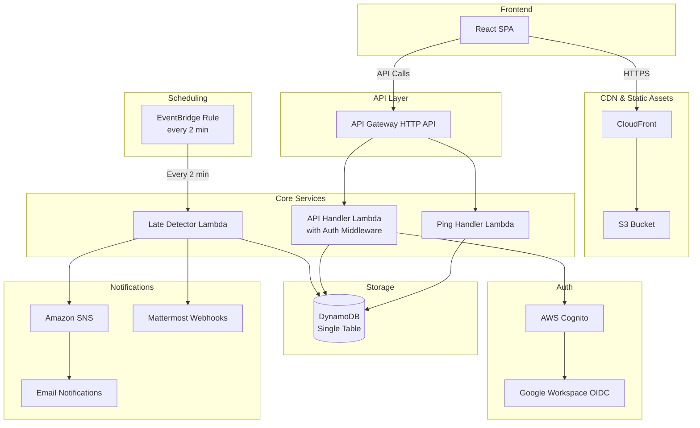

# Architecture

## Overview

Pulsechecks is a serverless, multi-tenant job monitoring service built entirely on AWS managed services. The architecture prioritizes low cost, high availability, and minimal operational overhead.

## System Architecture

## Components

### Frontend (React SPA)
- Single-page application built with React
- Hosted on S3, served via CloudFront
- OAuth integration with Google Workspace
- Real-time check status and ping history

### Authentication
- **AWS Cognito**: JWT token management
- **Google Workspace OIDC**: Primary authentication
- Domain allowlist for access control
- Team-based authorization

### API Layer
- **API Gateway HTTP API**: RESTful endpoints
- **Ping Handler Lambda**: Processes incoming pings (no auth)
- **API Handler Lambda**: Authenticated operations with middleware

### Storage (DynamoDB Single Table)
- **Teams**: Multi-tenant isolation
- **Users**: Profile and membership data
- **Checks**: Monitoring configuration
- **Pings**: History with 30-day TTL
- **Alert Channels**: Notification configuration

### Monitoring & Alerting
- **EventBridge**: Triggers late detection every 2 minutes
- **Late Detector Lambda**: Identifies overdue checks
- **SNS**: Notification routing
- **SES**: Email delivery
- **Webhooks**: Mattermost integration

## Data Model

### Single Table Design

| Entity | PK | SK | Attributes |
|--------|----|----|------------|
| Team | TEAM#{teamId} | METADATA | name, createdAt |
| Membership | TEAM#{teamId} | MEMBER#{userId} | role, joinedAt |
| User | USER#{userId} | PROFILE | email, name, createdAt |
| Check | TEAM#{teamId} | CHECK#{checkId} | name, periodSeconds, graceSeconds, status, lastPingAt, nextDueAt, alertAfterAt, token |
| Ping | CHECK#{checkId} | PING#{epochMillis} | receivedAt, data (TTL: 30 days) |

### Global Secondary Indexes

- **DueIndex**: GSI1PK=DUE, GSI1SK=alertAfterAt (for late detection)
- **TokenIndex**: GSI2PK=TOKEN#{token}, GSI2SK=CHECK (for ping lookup)

## Security

- All secrets in AWS SSM Parameter Store
- JWT validation via Cognito JWKS
- Domain allowlist enforcement
- RBAC at team level
- HTTPS only, no hardcoded credentials

## Scalability

- **Serverless**: Auto-scaling Lambda functions
- **DynamoDB**: On-demand billing, unlimited scale
- **CloudFront**: Global CDN distribution
- **API Gateway**: Built-in throttling and caching

## Cost Optimization

At low usage (100 checks, mixed intervals):
- DynamoDB: ~$1-2/month (on-demand)
- Lambda: ~$0.50/month
- API Gateway: ~$1/month
- EventBridge: ~$0.10/month
- SES: ~$0.10/month (first 62k emails free)
- CloudFront: ~$0.50/month
- S3: ~$0.10/month

**Total**: ~$3-5/month
